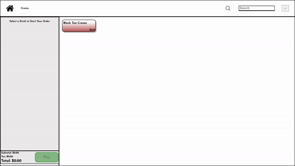

<h3>This project was deeply inspired by Clover and ShareTea</h3>

This project's purpose was to familiarize myself with React, but also to understand utilizing a database, specifically MongoDB

Below you can see how the app function, which should be simliar to how Clover visibily operates with a bit of my own touches

<h3>Customizing your drink</h3>

<h3>Searching for your drink</h3>

<h3>Editing a drink in the order</h3>

<h3>Deleting a drink in the order</h3>

<h3>Adding a category to the POS system and the DB</h3>

<h3>Adding a drink to the chosen category and the DB</h3>

<h3>Deleting a drink from the chosen category and the DB</h3>

<h2>Learned</h2>
<ul>
  <li>Database Usage</li>
  <li>Better grasp of React</li>
    <ul>
      <li>React function such as useState and useEffect</li>
      <li>Prop Usage</li>
      <li>Page Structure Utilizing Many Componets</li>
    </ul>
  <li>MongoDB Schema Models</li>
  <li>Express Routes</li>
</ul>
<h2>Improvements</h2>
<ul>
  <li>Folder Structure/Organization</li>
  <li>Code Organization</li>
  <li>More Componets to make code cleaner</li>
  <li>Better State Management</li>
  <li>Usage of more React functions such as createContext, useReducer, and useActionState</li>
</ul>
<h2>Known Issues</h2>
<ul>
  <li>Payment screen unfinished</li>
  <li>When editing a drink, the position changes when it should maintain it</li>
  <li>Responsiveness not fully implemented</li>
  
</ul>
